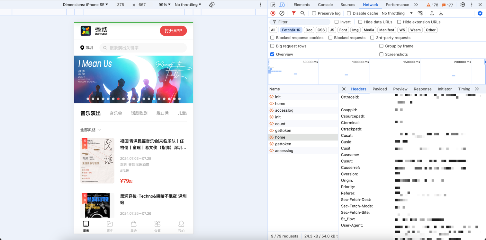

# go_showstart
## 项目介绍
go_showstart是一个基于golang的秀动抢票工具，可以帮助用户快速抢票。

## 注意事项：
    1.目前并没有识别所有的参数类型，只支持了部分参数类型，欢迎大家提交PR。
    2.本项目只是个辅助工具，不能保证一定能抢到票，只是提高抢票成功率
    3.存在一些活动开票前支持wap端抢票，但是开票后只能在app端抢票的情况，故千万不能只依赖本项目！

## 使用说明
1. 保证程序和config.yaml在同一目录下，直接运行可执行文件即可。
2. 使用前，请登陆App 提前填写好观演人的实名信息，遇到需要实名的情况，程序会根据名字自动填写。


## 配置说明
参考`config.example.yaml`文件，配置文件需要放在和可执行文件同级目录下，配置文件名为`config.yaml`

### system
- max_goroutine: 最大并发数
- min_interval: 最小请求间隔
- max_interval: 最大请求间隔

### showstart
1. [登陆秀动网页版](https://wap.showstart.com)
2. F12打开浏览器开发者工具，刷新页面找到请求信息。如图：

3. 切换到缓存选项卡，找到其他对应字段信息，填写到配置中，如图：


### ticket
- activity_id: 活动id（进入到活动后，可以通过url查看到ID）
- start_time: 抢票时间
- list: 抢票信息，
  - session：场次
  - price：价格
- people:观演人姓名


## 写在最后
本软件免费使用，请勿轻信他人。希望大家能原价购买到心仪的票，见到自己想见的人。

```diff
- 请勿使用本软件用于获利 本软件仅用于学习使用
- 希望大家能够遵守相关法律法规，不要用于非法用途。
```