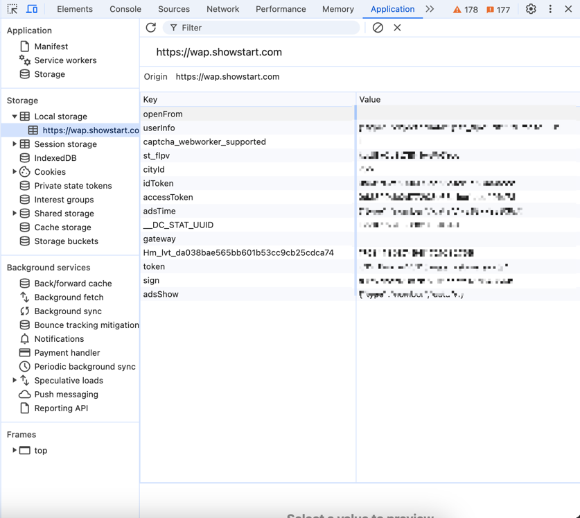

# go_showstart
## 项目介绍
go_showstart是一个基于golang的秀动抢票工具，可以帮助用户快速抢票。

## 注意事项：
    1.目前并没有识别所有的参数类型，只支持了部分参数类型，欢迎大家提交PR。
    2.本项目只是个辅助工具，不能保证一定能抢到票，只是提高抢票成功率
    3.存在一些活动开票前支持wap端抢票，但是开票后只能在app端抢票的情况，故千万不能只依赖本项目！

## 使用说明
1. 在 [Releases](https://github.com/staparx/go_showstart/releases)中，下载对应系统的可执行文件。
2. 参考`config.example.yaml`文件，配置文件需要放在和可执行文件同级目录下，配置文件名为`config.yaml`。
3. 保证可执行文件和config.yaml在同一级目录下，然后执行可执行文件即可。
4. 使用前，请登陆App 提前填写好观演人的实名信息，遇到需要实名的情况，程序会根据名字自动填写。

## 配置说明

### system
- max_goroutine: 最大并发数
- min_interval: 最小请求间隔
- max_interval: 最大请求间隔

### showstart
1. [登陆秀动网页版](https://wap.showstart.com)
2. F12打开浏览器开发者工具，刷新页面找到请求信息。如图：

3. 切换到缓存选项卡，找到其他对应字段信息，填写到配置中，如图：



### ticket
- activity_id: 活动id（进入到活动后，可以通过url查看到ID）
- start_time: 抢票时间
- list: 抢票信息，
  - session：场次
  - price：价格
- people:观演人姓名


### smtp_email
- enable: 1 开启 0 关闭
- host: `"smtp.qq.com"` 邮箱服务器
- username: `"...@qq.com"` SMTP邮箱
- password: `""`  SMTP邮箱服务授权码
- email_to: `"...@qq.com"` 接收消息邮箱


## 自主开发
介绍部分参数定义，方便大家自主开发。调用秀动的接口方法在`client`文件夹中。
### cusat和cusid
- 代码：/client/service.go/GetToken()
- 返参：`access_token`用于Header的cusat`id_token`用于Header的cusid

### traceId
- 代码：/util/trace.go/GenerateTraceId()
- 返参：`traceId`用于Header的traceId
- 解释：`traceId`是一个唯一标识，用于标识请求的唯一性，具体生成方式可以参考代码。由随机数和时间戳组成。

### crpsign
- 代码：/util/sign.go/GenerateSign()
- 返参：`crpsign`用于Header的crpsign
- 解释：`crpsign`是一个加密字段，用于校验请求的合法性，具体加密方式可以参考代码。每次请求时都需要将cusat、cusid、traceId、path等字段拼接后进行Md5加密，得到`crpsign`字段。

### 特殊请求
- 代码：/util/aes.go/AESEncrypt()
- 返参：`data`字段内容
- 解释：部分请求需要对请求参数进行加密，具体加密方式可以参考代码。需要将请求参数进行AES加密，得到`data`字段内容。

### 代补充参数
- 代码：/vars/const.go
- 解释：
  - EncryptPathMap：特殊请求，需要加密的请求路径。
  - NeedCpMap：根据请求返参的buy_type，判断是否需要填写观演人信息的票务类型。
  - SaleStatusMap：未使用，记录了已知的返参值对应的票务状态。


## 写在最后
本软件免费使用，请勿轻信他人。希望大家能原价购买到心仪的票，见到自己想见的人。

```diff
- 请勿使用本软件用于获利 本软件仅用于学习使用
- 希望大家能够遵守相关法律法规，不要用于非法用途。
```